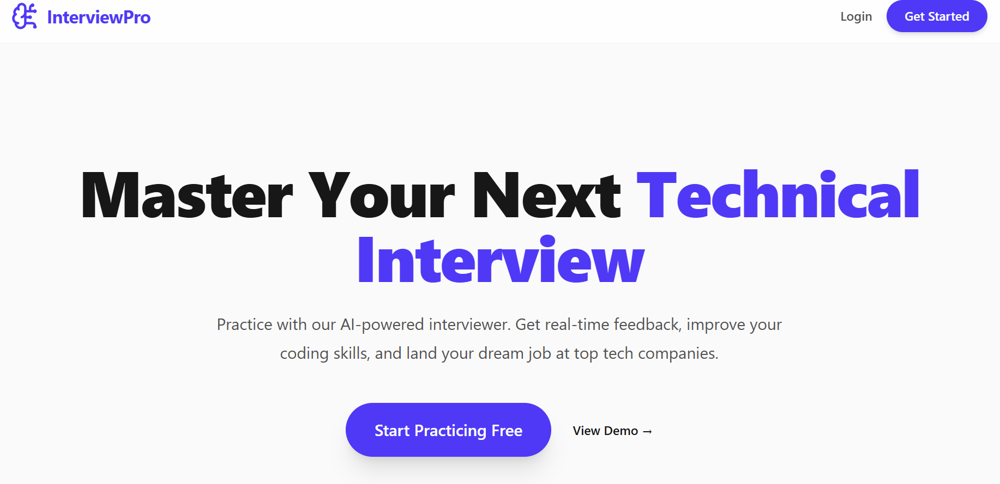
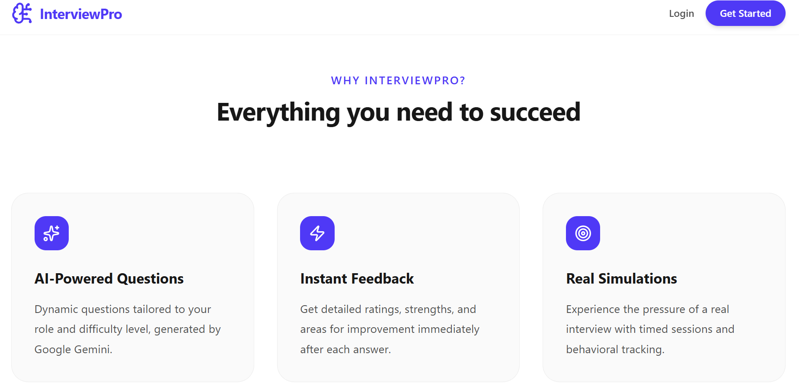
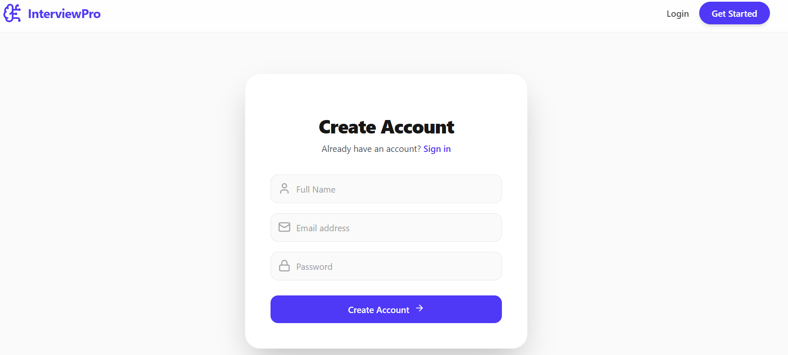
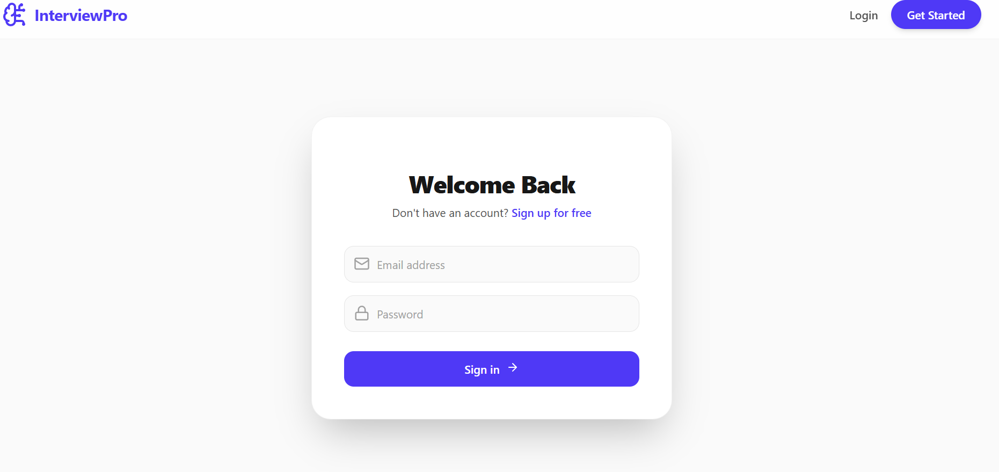
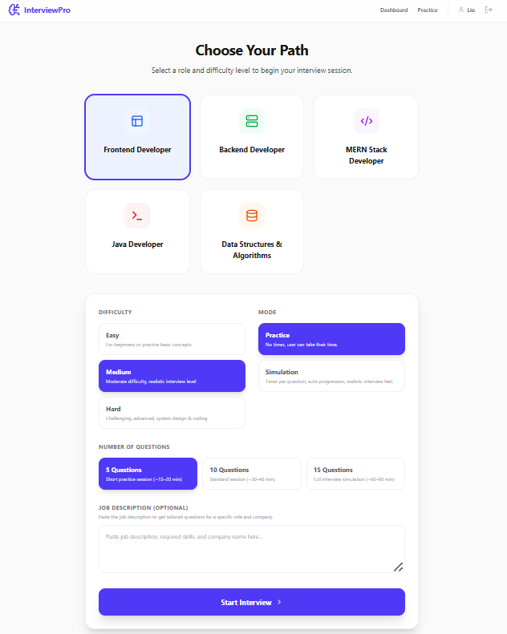
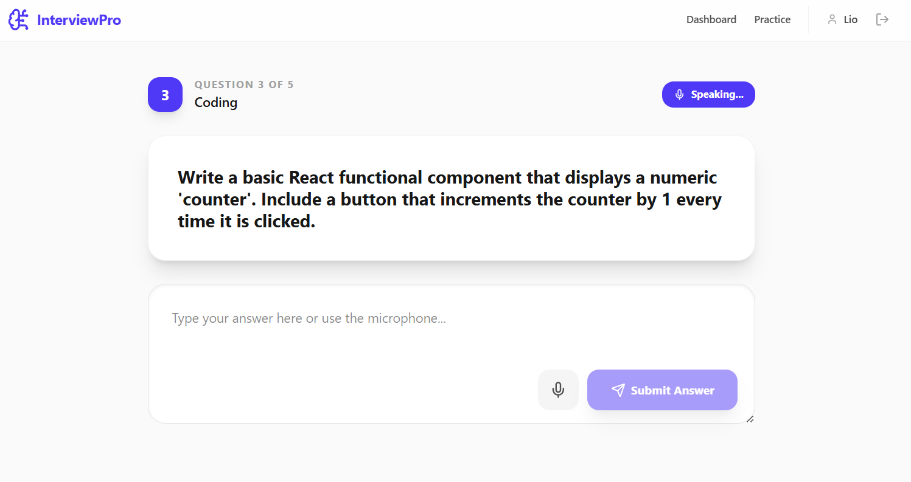
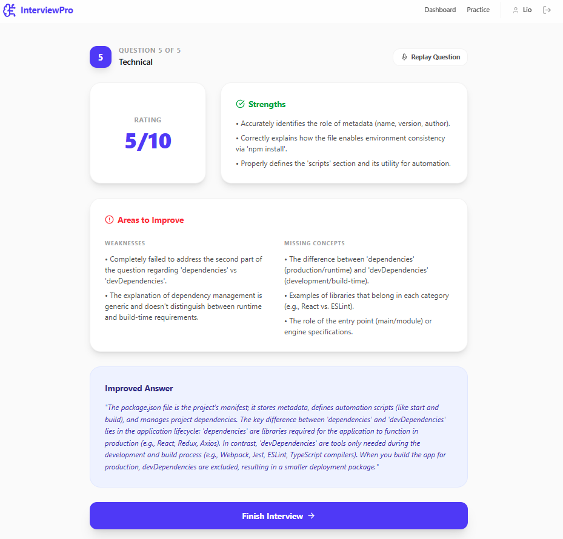
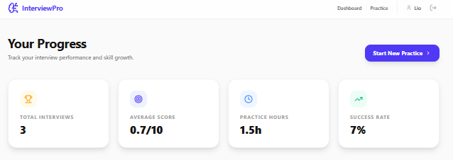
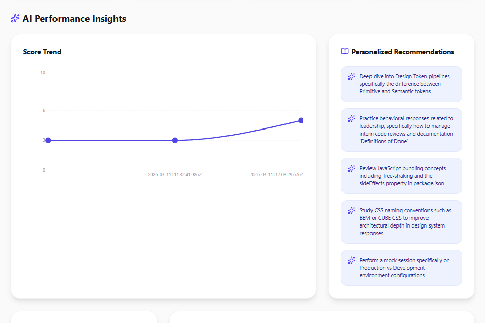
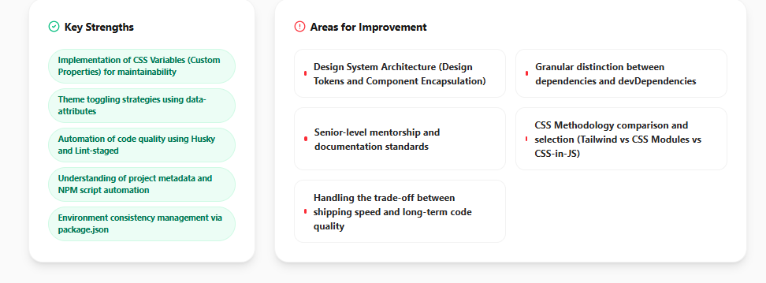

<h1 align="center">AI Interview Practice Platform</h1>

<p align="center">
An AI-powered platform to simulate real technical interviews and provide intelligent feedback.
</p>

<p align="center">

  
  
  
  
  
  
  
  
  
  

</p>

---

## Overview

**AI Interview Practice Platform** is a full-stack application that helps developers prepare for technical interviews using AI.

Users can select a job role, answer AI-generated interview questions, and receive **instant feedback, scoring, and improvement suggestions**.

The platform simulates **real interview scenarios** to help users improve their communication, technical knowledge, and confidence.

---

## ✨ Features

- **AI-generated interview questions** based on selected role
- **Answer evaluation and scoring** using AI
- **Performance feedback with strengths and improvement areas**
- **Interview history and progress tracking**
- **Role-based interview practice** (Frontend, Backend, MERN, etc.)
- **Responsive UI for desktop and mobile**

---

## 🛠 Tech Stack

### Frontend

- React.js
- Tailwind CSS
- JavaScript

### Backend

- Node.js
- Express.js

### AI Integration

- Google Gemini API

### Database

- MongoDB

### Tools

- Git
- GitHub
- Postman

---

## 📁 Project Structure

```
AI-Interview-Platform
│
├── frontend
│   ├── components
│   ├── pages
│   ├── hooks
│   └── services
│
├── server
│   ├── routes
│   ├── controllers
│   ├── models
│   └── middleware
│
└── README.md
```

---

## ⚙️ Installation & Setup

### 1️⃣ Clone the Repository

```bash
git clone https://github.com/your-username/ai-interview-platform.git
```

### 2️⃣ Navigate to the Project Folder

```bash
cd ai-interview-platform
```

### 3️⃣ Install Dependencies

Frontend

```bash
cd frontend
npm install
```

Backend

```bash
cd backend
npm install
```

---

### ▶ Run the Application

Backend

```bash
npm start
```

Frontend

```bash
npm run dev
```

---

## 🔑 Environment Variables

Create a `.env` file in the backend folder.

```
MONGO_URI=your_mongodb_connection
JWT_SECRET=your_secret_key
GEMINI_API_KEY=your_google_ai_api_key
PORT=5000
```

---

## 🚀 Future Improvements

- 🎙 Voice-based interview interaction
- 📈 AI-based skill improvement analytics
- 💼 Resume-based interview questions
- 🧑‍💻 Coding challenge integration

---

## 👨‍💻 Author

**Rahul Yadav**

🌐 GitHub: https://github.com/Liorhx

---

<p align="center">
⭐ If you like this project, consider giving it a star on GitHub!
</p>
